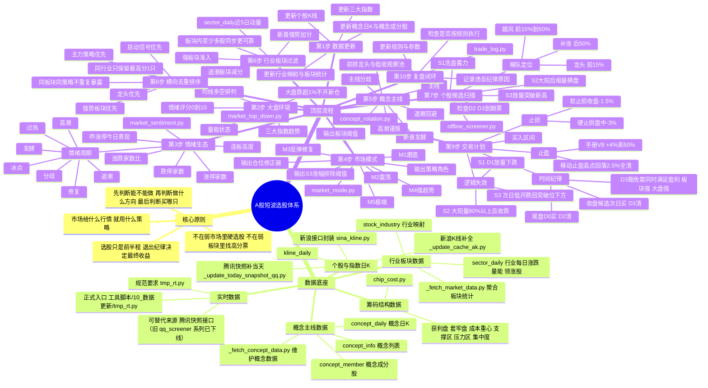

# A股选股整体逻辑思维导图

更新日期：2026-05-27  
检查范围：`交易体系/` 规则文档、`工具脚本/10_数据更新/`、`工具脚本/20_市场环境/`、`工具脚本/30_候选短股/`、`工具脚本/40_个股分析/`、`工具脚本/00_公共核心/`

> 这份图是“体系全景图 + 当前实现检查”。核心不是找单只票，而是把整个选股机器拆开：数据从哪里来、先否决什么、什么行情启用什么策略、候选如何排序、买入后怎么退出。

---

## 一图总览



---

## 文字版详图

### 1. 系统总目标

这套体系做的是 A 股短波候选，不是长期基本面估值体系。目标是用 1 到 3 个交易日吃启动第一波，核心收益来源是：

1. 在市场可操作时开仓。
2. 在强板块、强概念里找前排。
3. 用 S1、S2、S3 匹配不同市场阶段。
4. 到了止盈止损和逻辑失效就机械执行。

底层假设是：短线胜率不只来自个股形态，更多来自“市场模式 + 情绪周期 + 板块方向 + 个股梯队”的共振。单只股票技术形态再好，如果处在退潮概念、弱势板块或错误市场模式里，都要降级或淘汰。

---

### 2. 数据底座

#### 2.1 个股与指数数据

主要表：`kline_daily`。  
包含个股和三大指数的日线数据：开高低收、成交量、成交额、换手率、涨跌幅。

主要脚本：

| 脚本 | 职责 | 在选股体系里的作用 |
|---|---|---|
| `工具脚本/10_数据更新/_update_cache_ak.py` | 用新浪日K接口补全数据库股票与指数数据 | 收盘后或日常更新个股K线主入口 |
| `工具脚本/10_数据更新/_update_today_snapshot_qq.py` | 用腾讯快照补齐最新交易日 | 新浪慢或盘后快照需要补当天时使用 |
| `工具脚本/10_数据更新/_refresh_stock_universe.py` | 重整沪深主板股票池 | 清理退市/异常状态，维护可扫描股票范围 |
| `工具脚本/00_公共核心/sina_kline.py` | 新浪K线接口封装 | 单股分析和部分更新脚本复用 |
| `工具脚本/00_公共核心/db_cache.py` | MySQL 兼容封装与表结构 | 全部脚本的数据底座 |

当前股票池原则：沪深主板为主，代码通常是 `sh.60*` 与 `sz.00*`。指数包括 `sh.000001`、`sz.399001`、`sz.399006`。

#### 2.2 行业板块数据

主要表：

| 表 | 内容 | 用途 |
|---|---|---|
| `stock_industry` | 股票到行业的映射 | 判断个股所属板块 |
| `sector_daily` | 每个行业每天的平均涨跌、上涨数、下跌数、成交额、换手率、领涨股 | 板块强弱、板块过滤、轮动预判、同板块去重 |

主要脚本：`工具脚本/10_数据更新/_fetch_market_data.py`。

工作方式：

1. 尝试用 baostock 获取行业分类映射。
2. 用新浪接口补三大指数日K。
3. 从 `kline_daily + stock_industry` 聚合出 `sector_daily`。
4. 后续 `market_sentiment.py` 和 `offline_screener.py` 都会用它判断行业强弱。

#### 2.3 概念主线数据

主要表：

| 表 | 内容 | 用途 |
|---|---|---|
| `concept_info` | 概念列表、代码、最新涨跌与排名 | 概念池 |
| `concept_daily` | 概念指数日K | 判断主线、分歧、高潮、退潮 |
| `concept_member` | 概念成分股 | 找概念内前排股 |

主要脚本：

| 脚本 | 职责 |
|---|---|
| `工具脚本/10_数据更新/_fetch_concept_data.py` | 用 akshare 获取东方财富/同花顺概念列表、日K和成分股 |
| `工具脚本/20_市场环境/concept_rotation.py` | 给概念打节奏标签，输出主线、分歧低吸池、新晋发酵、高潮、退潮 |

概念主线在 V9 里很关键：它不是简单看今天涨幅，而是看今天排名、3/5/20日涨幅、5日平均排名、排名变化、量能放大、是否站上 MA20。

#### 2.4 筹码结构数据

主要脚本：`工具脚本/00_公共核心/chip_cost.py`。

输出维度：

1. 成本重心。
2. 获利盘比例。
3. 套牢盘比例。
4. 筹码集中度。
5. 下方支撑区。
6. 上方压力区。
7. 入场区间是否被筹码压力压住。

当前代码里，筹码更多用于 `offline_screener.py` 的操作计划、止盈止损和压力支撑判断；手册 V8 里则希望筹码结构成为 S1 评分的一部分。

#### 2.5 实时数据

规则文档要求盘中分析必须拉实时行情，并提到 `tmp_rt.py`。当前已新增正式入口：`工具脚本/10_数据更新/tmp_rt.py`，可按代码拉取当前价、涨跌幅、日内高低、成交额、换手率、外/内比。现有可替代能力是：

1. `工具脚本/10_数据更新/_update_today_snapshot_qq.py`：腾讯快照补当天数据。
2. ~~`工具脚本/30_候选短股/qq_screener.py` / `qq_screener_v2.py`~~：基于腾讯/新浪的盘中候选扫描旧流程，已删除（实时行情走 `tmp_rt.py`，选股走 `offline_screener.py`）。

这意味着：如果严格执行“每次股票问题先拉实时盘口”，当前仓库缺一个稳定、正式命名的实时行情工具入口。

---

### 3. 市场环境判定

#### 3.1 大盘环境：market_top_down.py

输入：三大指数近 120 天日K。  
输出：趋势、量能、涨跌、支撑阻力、情绪指数、操作建议。

核心指标：

1. MA5、MA10、MA20、MA60、MA120。
2. 均线多空排列。
3. 5日/20日量比。
4. 连涨连跌天数。
5. 5日、10日、20日涨跌幅。
6. 近5日平均振幅。
7. 情绪评分 0 到 10。

操作解释：

| 情绪区间 | 建议 |
|---|---|
| 7 到 10 | 可以积极做多，但防追高 |
| 5 到 6 | 可以操作，精选个股 |
| 3 到 4 | 谨慎轻仓 |
| 0 到 2 | 不宜操作，空仓或只卖不买 |

#### 3.2 涨停生态与情绪周期：market_sentiment.py

这是短线节奏模块，判断市场是冰点、修复、发酵、高潮、分歧、退潮还是过热。

核心输入：

1. 近20个交易日全市场涨跌幅。
2. 涨停家数，阈值 `pctChg >= 9.5`。
3. 跌停家数，阈值 `pctChg <= -9.5`。
4. 上涨家数、下跌家数、涨跌比。
5. 昨日涨停股今日平均表现。
6. 最高连板高度。
7. 大涨超过 5% 的家数。
8. `sector_daily` 的板块排名变化。

情绪得分 0 到 12：

| 维度 | 满分 | 当前代码口径 |
|---|---:|---|
| 涨停家数3日均 | 3 | 30/50/80 档 |
| 涨跌比3日均 | 3 | 0.5/1/3 档 |
| 昨涨停今日表现 | 3 | 均涨 0/1/2 档 |
| 连板高度 | 3 | 3/5/6 档 |
| 趋势与风险修正 | 加减分 | 涨停加速、跌停警告等 |

阶段含义：

| 阶段 | 对选股的影响 |
|---|---|
| 冰点 | 可开始看 S1 蓄力，但通常不急开仓 |
| 修复 | S1/S2 小仓试探 |
| 发酵 | S2/S3 主力参与 |
| 高潮 | 仓位减半，提前止盈，不追后排 |
| 分歧 | 仓位减半，只做龙头或等待低吸确认 |
| 退潮 | 禁止新开仓，强制空仓思维 |
| 过热 | 禁止新开仓 |

仓位修正器：

| 情绪阶段 | position_modifier |
|---|---:|
| 冰点/修复/发酵 | 1.0 |
| 高潮 | 0.5 |
| 分歧 | 0.5 |
| 退潮/过热 | 0 |

#### 3.3 市场模式：market_mode.py

市场模式是“趋势骨架”，情绪周期是“短期节奏”。两者组合后决定：今天用哪些策略、板块阈值多严、仓位是否减半。

手册里的模式逻辑：

| 模式 | 名称 | 触发特征 | 主策略 | 辅策略 | 弱势策略 |
|---|---|---|---|---|---|
| M1 | 磨底期 | 情绪1-3，指数弱于MA60 | S1 | 无 | S2/S3 小仓试探 |
| M2 | 震荡期 | 情绪4-5，指数方向不明 | S1 | S2 | S3 小仓试探 |
| M3 | 反弹修复 | 情绪6-7，5日涨超3%，站上MA20 | S2 | S3 | S1 小仓试探 |
| M4 | 强趋势 | 情绪8-9，指数强于MA60，MA20强于MA60 | S3 | S2 | S1 小仓试探 |
| M5 | 极端 | 情绪小于等于1或大于等于10，或退潮/过热 | 空仓 | 无 | 全禁用 |

当前代码逻辑：

1. 先用三大指数计算综合情绪。
2. 创业板权重更高，作为反弹敏感参考。
3. 再根据指数与 MA20/MA60、5日涨幅判断 M1 到 M5。
4. 再调用 `market_sentiment.py` 的周期结果。
5. 若周期为退潮或过热，直接把模式强制降为 M5。
6. 若周期为高潮或分歧，仓位修正为 0.5。

---

### 4. 概念主线与行业板块

#### 4.1 概念主线：concept_rotation.py

概念阶段不是二选一，而是一个交易地图：

| 阶段 | 规则含义 | 操作方式 |
|---|---|---|
| 主线 | 5日平均排名高，20日强，站上MA20 | 顺势找前排 S2/S3，或主线内 S1 前排蓄力 |
| 主线分歧 | 主线仍在，但当日回落且仍在MA20上 | 等低吸，不追高，只看前排承接 |
| 新晋发酵 | 今日排名靠前，5日排名明显上升 | 小仓试错，必须多股同步 |
| 高潮谨慎 | 短期涨幅大、量能放大、排名极靠前 | 只止盈持仓，不追后排 |
| 退潮回避 | 排名大幅后退且5日弱 | 即使形态达标也降级或回避 |
| 普通轮动 | 没有持续性 | 降低优先级 |

前排定位：概念成员按近5日涨幅和成交额排序，前15%为龙头，前15%到50%为跟风，后50%为补涨。

#### 4.1.1 产业链主线家族与20日持续性（V11新增）：theme_family.py

只看“今天主线”会跑出偶发轮动方向（某天证券/银行/医药突然冲到前面），把真正在回调的产业链主线（如半导体链）埋没。V11 加了两层：

1. 概念级20日持续性（concept_rotation.py）：每个概念统计近20个交易日有多少天处于前20%（`top_days20`、`persist20`），打三类标签——
   · 持续强势（≥10/20天）、阶段强势（6~9天）、偶发轮动（今天前15%但20日很少强）。持续性会加权到概念分数，偶发轮动会被压低；CLI 多出“持续主线概念 / 今日偶发轮动”两张表。
2. 产业链家族（theme_family.py + theme_family_map.json）：把零散概念按产业链归族（半导体国产链、AI算力硬件链、AI应用端侧链、华为信创链、消费电子面板链、机器人链、新能源车链、创新药链、军工航天链、算力电力链）。家族内有≥20%成员概念当日处于前20%记为“活跃日”，统计近20日活跃天数，分为持续主线(≥10)/阶段主线(6~9)/轮动活跃/退潮中/普通。

用法核心：先在“持续/阶段主线家族”里选票；家族今日回调但20日持续天数高时是低吸机会，不是退潮；家族内按“今日领涨细分”轮动选前排（液冷↔铜箔↔封测↔存储↔光互连之间轮动），强确定性主线成员可中长期持有。`offline_screener.py` 已把家族持续性叠加为候选加成（持续主线成员+2、阶段主线+1，与概念阶段合并正向封顶+3），并在最终推荐表用〔家族·状态N/20〕标注。映射文件用 `theme_family.py --draft` 出成分股重叠聚类草稿后人工维护。

#### 4.2 行业板块过滤

板块过滤是 V8 的核心变化：从“淘汰弱板块”升级为“只看强板块”。

手册 V8 准入线：

| 模式 | S1 | S2 | S3 |
|---|---|---|---|
| M1 | 前50% | 无 | 无 |
| M2 | 前50% | 前40% | 无 |
| M3 | 前40% | 前30% | 前30% |
| M4 | 无 | 前30% | 前25% |
| M5 | 无 | 无 | 无 |

实际实现要注意：`offline_screener.py` 使用的是 `sector_rank`，弱板块接近 0，强板块接近 1；当前已经将 `market_mode.py` 的 `sector_cutoff` 统一为“强度分位准入线”，例如 0.70 代表约前30%强板块。

---

### 5. 三大选股策略

#### 5.1 S1 洗盘蓄力策略

适用市场：M1 磨底、M2 震荡。  
核心假设：主力已介入并经历洗盘，成交量萎缩、波动收敛、筹码结构干净，等待启动。

手册 V8 版本：16分制，5个指标。

前置过滤：

| 编号 | 条件 |
|---|---|
| F1 | 流通市值 30亿到300亿 |
| F2 | 近60日至少1次涨停 |
| F3 | 近60日涨幅 10%到60% |
| F4 | 从60日高点回撤 5%到20% |
| F5 | 现价强于 MA60 |

核心评分：

| 指标 | 满分 | 含义 |
|---|---:|---|
| 缩量程度 | 3 | 5/20量比、5/60量比、换手、连续缩量、地量 |
| 波动收敛 | 5 | ATR收敛、5日价格区间、均线间距、重心稳定、支撑守住 |
| 板块内排名 | 3 | 龙头/跟风/补涨，且板块本身不弱 |
| 红绿交替 | 2 | 近5日非单边，涨跌温和 |
| 筹码结构 | 3 | 获利盘、上方套牢、筹码集中度 |

评级：

| 等级 | 分数 | 操作 |
|---|---:|---|
| A | 大于等于13/16 | 正常A级仓位 |
| B | 11到12/16 | 半仓位 |
| 淘汰 | 小于等于10/16 | 不推荐 |

启动信号：

1. 放量突破，成交量大于近5日均量2倍且涨幅大于3%。
2. 收盘突破横盘上沿。
3. MA5 金叉 MA10。
4. 集合竞价高开超过1%且竞价量放大。

当前代码状态：`offline_screener.py` 已改为 V8 16分/5指标体系，并纳入板块内排名、筹码结构、X6/X7/X8排除项；旧入口 `auto_screener.py`、`ak_screener.py`、`qq_screener.py`/`qq_screener_v2.py` 系列已删除，选股统一以 `offline_screener.py` 为准。

#### 5.2 S2 大阳后缩量横盘策略

适用市场：M3 反弹修复，M2 震荡也可辅助。  
核心假设：放量大阳线代表主力进场，随后缩量横盘代表主力没有出货，只是在消化浮筹。

前置过滤：

| 编号 | 条件 |
|---|---|
| F1 | 流通市值 30亿到300亿 |
| F2 | 近5日有大阳线：单日涨幅大于等于4%，收阳，成交量大于20日均量1.5倍 |
| F3 | 大阳后缩量：后续均量小于大阳当日量70% |
| F4 | 现价不跌回大阳线开盘价 |
| F5 | 现价强于 MA60 |
| F6 | 板块符合当前模式准入线 |

评分：8分制。

| 指标 | 满分 |
|---|---:|
| 缩量程度 | 2 |
| 价格守住 | 2 |
| 板块强度 | 2 |
| 均线配合 | 2 |

评级：A 大于等于7分，B 等于6分，小于等于5分淘汰。

逻辑失效：大阳后量放大到大阳线80%以上且收跌，说明可能出货，不等价格止损。

当前代码状态：`offline_screener.py` 的 S2 逻辑与手册整体较接近，已接入新板块准入口径、概念阶段加减分和试探仓规则。

#### 5.3 S3 放量突破新高策略

适用市场：M4 强趋势，M3 反弹修复也可辅助。  
核心假设：趋势市资金愿意在更高价格接力，真正强的票会放量突破近20日高点。

前置过滤：

| 编号 | 条件 |
|---|---|
| F1 | 流通市值 30亿到300亿 |
| F2 | 收盘价突破近20日最高价 |
| F3 | 当日量大于20日均量1.5倍 |
| F4 | 收阳线 |
| F5 | 现价强于 MA20，MA20 强于 MA60 |
| F6 | 板块符合当前模式准入线 |

评分：6分制。

| 指标 | 满分 |
|---|---:|
| 突破幅度 | 2 |
| 放量程度 | 2 |
| 板块力度 | 2 |

评级：A 大于等于5分，B 等于4分，小于等于3分淘汰。

排除项：

1. 今日涨幅大于7%。
2. 近5日涨幅超过模式允许上限。
3. 换手率大于10%。
4. 缩量突破。
5. 上方5%内有筹码密集压力。

S3 X2 动态放宽：

| 模式 | 默认排除 | 强板块放宽 |
|---|---:|---:|
| M1/M2 | 近5日涨幅大于20% | 无 |
| M3 | 大于25% | 板块TOP30%时放宽到30% |
| M4 | 大于35% | 板块TOP20%时放宽到40% |

当前代码状态：`offline_screener.py` 已实现 S3 的模式化 X2 放宽，并已接入新板块准入口径、概念阶段加减分和试探仓规则。

---

### 6. 候选排序与去重

候选不是只按分数排，排序逻辑是多维的：

1. 当前模式里的主力策略优先于辅助策略。
2. 同等级里，强板块优先。
3. 同板块里，龙头优先于跟风，跟风优先于补涨。
4. 有启动信号优先。
5. 新晋强势板块候选加分。
6. 退潮板块候选减分。
7. S1/S2/S3 合并后，同行业只保留最高分一只。
8. 持仓已有同板块时，新候选原则上禁止买入。

梯队定位：

| 梯队 | 板块内近5日涨幅排名 | 解释 |
|---|---|---|
| 龙头 | 前15% | 资金最集中，优先级最高 |
| 跟风 | 前15%到50% | 可以做，但优先级低于龙头 |
| 补涨 | 后50% | 形态再好也要降级 |

---

### 7. 仓位、止盈止损与时间纪律

#### 7.1 仓位体系

手册 V8 仓位表：

| 模式 | S1-A | S1-B | S2-A | S2-B | S3-A | S3-B |
|---|---:|---:|---:|---:|---:|---:|
| M1 | 1/4 | 1/8 | 1/12 | 1/16 | 1/12 | 1/16 |
| M2 | 1/4 | 1/8 | 1/4 | 1/8 | 1/12 | 1/16 |
| M3 | 1/12 | 1/16 | 1/4 | 1/8 | 1/4 | 1/8 |
| M4 | 1/12 | 1/16 | 1/4 | 1/8 | 1/4 | 1/8 |
| M5 | 无 | 无 | 无 | 无 | 无 | 无 |

情绪周期修正：高潮和分歧再乘 0.5，退潮和过热为 0。

总控规则：

1. 最大同时持仓 2 只。
2. 总暴露上限 2/3 资金。
3. 每日最多新开仓 1 只。
4. 每周新开仓频率按 M1 到 M5 控制。
5. 同板块不得重复暴露。

#### 7.2 止盈止损

手册 V8 统一退出：

| 项目 | 规则 |
|---|---|
| 止盈1 | 浮盈 +4%，卖50% |
| 止盈2 | 从盘中最高点回落2.5%，剩余全清 |
| 硬止损 | 盘中跌破买入价 -3%，市价卖出 |
| 软止损 | 收盘低于买入价 -1.5%，次日开盘清仓 |
| 逻辑失效 | 优先级高于价格止损，触发即走 |

三策略逻辑失效：

| 策略 | 逻辑失效条件 |
|---|---|
| S1 | D1 放量下跌，不是缩量洗盘 |
| S2 | 量放大到大阳线80%以上且收跌 |
| S3 | 次日低开跌回突破位下方 |

#### 7.3 时间纪律

| 方案 | 时间线 | 纪律 |
|---|---|---|
| 尾盘当日方案 | D0 14:00选股，14:40到14:55买入，D2清仓 | 当前主方案，数据确定性最高 |
| 收盘候选次日方案 | D0收盘生成候选，D1竞价确认买入，D3清仓 | 备选方案，需要竞价过滤 |

D3 豁免条件：必须同时满足盈利超过2%、板块当日涨幅超过1%且仍领涨、大盘情绪大于等于6。延期后止损上移到成本价加1%，次日尾盘无条件清仓。

---

## 当前实现检查结论

### 1. 已经比较完整的部分

1. 数据表结构完整：个股、指数、行业、概念、交易记录、ETF 相关表都在 `db_cache.py` 中统一维护。
2. 市场环境链路完整：`market_top_down.py`、`market_sentiment.py`、`market_mode.py` 三层能形成“大盘趋势 + 情绪周期 + 模式调度”。
3. 概念主线已成体系：`concept_rotation.py` 能输出主线、分歧、新晋、高潮、退潮，并能列前排。
4. S2/S3 在 `offline_screener.py` 中已基本实现为可运行扫描逻辑。
5. 梯队定位、板块轮动加减分、跨策略同行业去重已经进入 `offline_screener.py`。
6. 筹码模块已可用，并且已经被离线选股器用于入场、止盈止损、支撑压力分析。

### 2. 本次已优化的问题

| 问题 | 优化结果 |
|---|---|
| S1文档16分制、代码20分制不一致 | `offline_screener.py` 已改为 V8 16分/5指标：缩量、波动收敛、板块内排名、红绿交替、筹码结构 |
| 板块准入线旧口径过宽 | `market_mode.py` 已改为强度分位准入线，0.70 表示约前30%强板块 |
| 弱势策略小仓试探未落地 | 新增 `trial` 策略角色，试探策略只允许A级候选进入，仓位按V8表缩小 |
| 止盈规则不统一 | `offline_screener.py` 已统一为 +4%卖50%，剩余按最高点回落2.5%移动止盈 |
| 概念主线未进入候选排序 | `offline_screener.py` 已加载概念阶段，对主线/分歧/新晋加权，对高潮降级，对退潮概念硬排除 |
| 实时行情入口缺失 | 新增 `工具脚本/10_数据更新/tmp_rt.py`，用于盘中/盘后拉腾讯实时行情 |
| 最终推荐仓位不分A/B | 最终推荐已按候选 `grade` 拼接 `S1_A/S1_B` 等仓位键，并叠加情绪修正 |

### 3. 仍需留意的剩余问题

| 优先级 | 问题 | 建议 |
|---|---|---|
| 已处理 | 旧入口 `auto_screener.py`、`ak_screener.py`、`qq_screener.py`/`qq_screener_v2.py` 系列 | 已于本轮清理中删除，选股统一走 `offline_screener.py` |
| 中 | 筹码分析仍是日K估算，不是真实逐笔筹码 | 只作为压力/支撑和评分辅助，不单独一票否决 |
| 中 | 概念成分股依赖接口数据完整性 | 每次重要选股前先更新 `_fetch_concept_data.py`，并人工复核最强概念前排；退潮概念已默认不进入推荐 |
| 中 | 单日最大亏损、周频率仍主要靠纪律 | 后续可在 `trade_log.py` 增加自动统计和禁止开仓提示 |

### 4. 严格度复核结论

本轮复核专门检查了“条件是否太严格导致选不出可以买入股票”。结论是：候选层不算过严，但买点层必须区分清楚。

关键发现：

1. S2/S3 应该是当前 M3 反弹修复模式的主要来源；S1 在 M3 中本来就是试探策略，只允许A级进入，当前为0属于可接受结果。
2. 腾讯快照入库的成交量字段原来直接使用 `items[36]`，该字段是“手”，历史K线是“股”口径，导致最新日量比被压低约100倍，S3 放量突破被误杀。已修正为乘以100，并批量修正 2026-05-26 最新日数据。
3. S1 的筹码压力5%内硬排除看起来很严，但模拟后即便取消硬排除，当前样本最高也只有8分，仍达不到V8 A级，因此不是S1清零的主因。
4. V8 固定 +4% 止盈、-3% 硬止损，天然盈亏比上限约1.3:1；原来用 1.5/2.0 评价盈亏比，会把正常V8计划误标成差。已改为 V8 短波口径：1.25以上为较好，1.0以上为可观察。
5. 最终推荐已新增“买点/仓位”状态，把候选分成可买、等回踩、等确认、仅观察，避免把所有候选都误读为立即买入。

### 3. 当前最合理的执行主线

在修复前，日常选股建议按这条主线执行：

1. 更新数据：`python 工具脚本/10_数据更新/_update_cache_ak.py`。
2. 若当天数据缺失，用腾讯补快照：`python 工具脚本/10_数据更新/_update_today_snapshot_qq.py`。
3. 更新行业板块统计：`python 工具脚本/10_数据更新/_fetch_market_data.py`。
4. 更新概念数据：`python 工具脚本/10_数据更新/_fetch_concept_data.py`。
5. 看大盘：`python 工具脚本/20_市场环境/market_top_down.py`。
6. 看模式与情绪：`python 工具脚本/20_市场环境/market_mode.py`。
7. 看概念主线：`python 工具脚本/20_市场环境/concept_rotation.py --days 120 --top 20`。
8. 盘中/点名实时行情：`python 工具脚本/10_数据更新/tmp_rt.py 代码`。
9. 扫候选：`python 工具脚本/30_候选短股/offline_screener.py`。
10. 人工复核候选是否在主线概念/强行业/前排梯队里。
11. 严格按买入区间、逻辑失效、止盈止损、D2/D3 时间纪律执行。

---

## 后续优化顺序

建议按影响大小排序修：

1. 清理或标注旧版筛选脚本，避免误用。
2. 在 `trade_log.py` 增加单日亏损、周开仓次数和同概念暴露的自动检查。
3. 为 `offline_screener.py` 增加前向验证落库，记录每个候选后续D1/D2/D3表现。
4. 后续如果连续多日“可买”为0，再考虑增加候选池/观察池，而不是直接放宽硬买入条件。

---

## 最短记忆版

这套系统的最短逻辑是：

```text
先更新数据
再判大盘能不能做
再判情绪是冰点 修复 发酵 高潮 分歧 退潮
再判市场模式 M1 到 M5
再看概念是否主线 行业是否强势
再按模式启用 S1 S2 S3
再按板块与梯队排序
再同行业去重
最后只在买入区间内下单
触发止盈 止损 逻辑失效 D2/D3 到期就执行
```

真正的胜负手不是某一个指标，而是四个一致：市场模式一致、概念方向一致、行业强度一致、个股梯队一致。四个一致时才值得正常仓位；只满足个股形态时，最多观察或小仓试探。